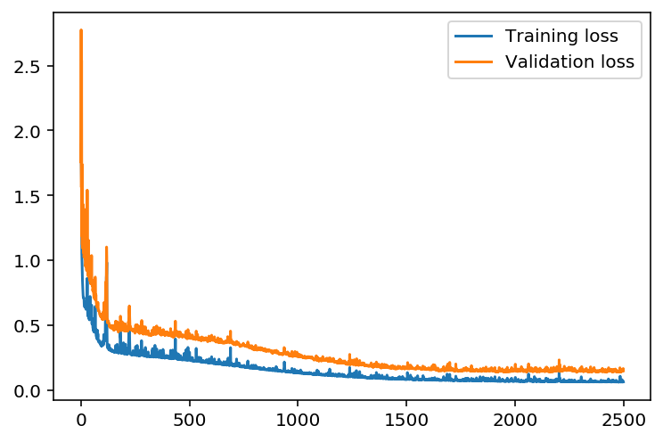
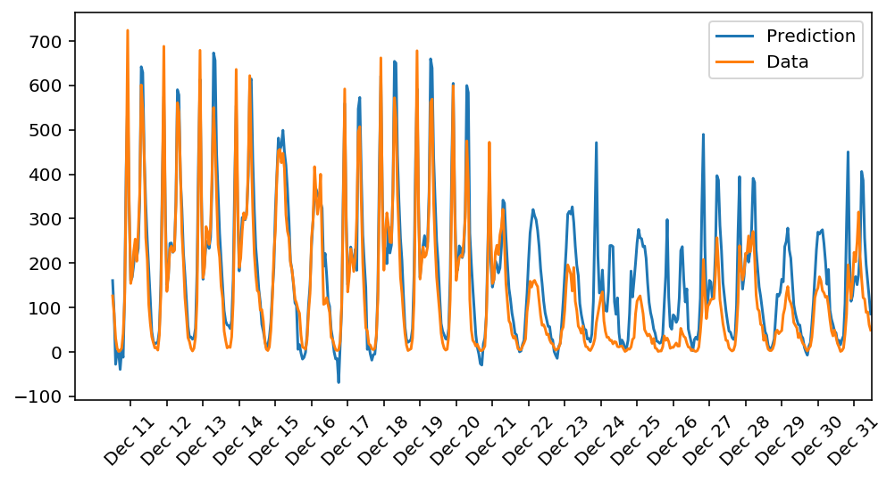

First project in Udacity's Deep Learning with pytorch nanodegree.

In this project we implement a simple neural network from scratch. This includes writing the routines for both forward pass and the backward pass. Later we use the neural network to learn the patterns in UCI's [bike-sharing-dataset](https://archive.ics.uci.edu/ml/datasets/bike+sharing+dataset). 

The evolution of training and validation loss can be seen in the following learning curve:

The predicitions on the test set have been compared to the true values in the following graph:

In general it looks like the model has learnt to predict the bike-rental patterns quite well with average error of only ~ 33 bikes. The fact that this is an impressively low error can be seen by comparing it to the average number of bikes rented out at any given hour, which is ~ 190. This gives us an error-rate of 33/190 ~ 0.17 per bike!